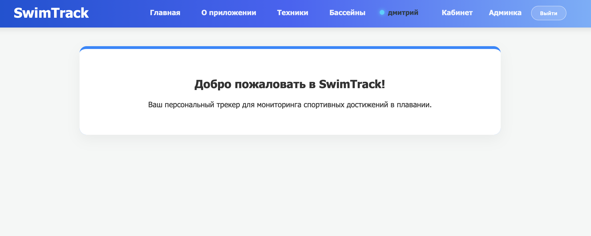
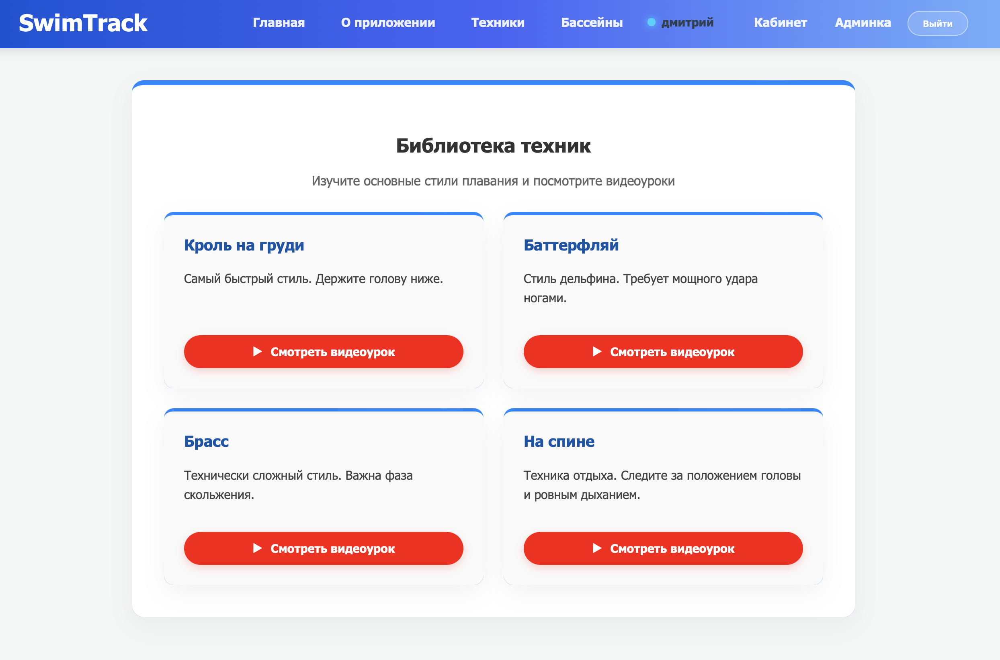
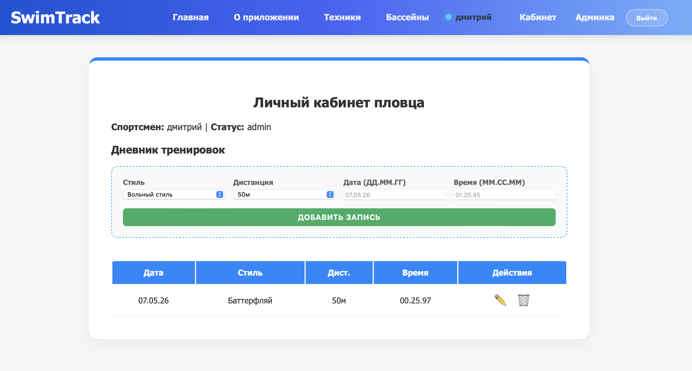

# SwimTrack

Платформа для пловцов — веб-система для отслеживания достижений, изучения техник и поиска бассейнов.

## Структура курса:
1. **lab1** — Проектирование архитектуры динамического веб-приложения.
2. **lab2** — Реализация бэкенда и базовой аутентификации.
3. **lab3** — Разработка клиентской логики и динамических страниц.
4. **lab4** — Финальная доработка, деплой и защита проекта.

**Автор:** Строчук Дмитрий, студент группы ПО-14.

---

##  Ссылки на Production
* **Сайт (Fullstack):** [https://swimtrack-eight.vercel.app/](https://swimtrack-eight.vercel.app/)
* **Репозиторий:** [https://github.com/DmitryUnix/swimtrack.git](https://github.com/DmitryUnix/swimtrack.git)
* **База данных:** Supabase (PostgreSQL Cloud)
* **Хостинг:** Vercel

##  Технологический стек
* **Frontend:** HTML5, CSS3, JavaScript.
* **Backend:** Node.js, Express.js.
* **Database:** PostgreSQL.
* **Безопасность:** JSON Web Tokens для авторизации, bcrypt для хеширования паролей.

##  Ключевые функции
* **Система авторизации:** Полный цикл регистрации и входа пользователей.
* **Каталог техник:** Динамическая подгрузка стилей плавания (Кроль, Баттерфляй и др.) из базы данных.
* **Поиск бассейнов:** Отображение актуальных площадок для тренировок.
* **Личный кабинет:** Управление профилем и просмотр избранного контента.
* **Адаптивность:** Интерфейс корректно отображается на ПК и мобильных устройствах.

##  Основные API Эндпоинты
* `POST /api/auth/register` — создание новой учетной записи.
* `POST /api/auth/login` — аутентификация и выдача JWT-токена.
* `GET /api/techniques` — получение списка всех техник из БД.
* `GET /api/pools` — список доступных бассейнов.
* `GET /api/favorites` — получение списка избранного.

##  Инструкция по локальному запуску

Если вы хотите запустить проект локально:

1.  **Клонируйте репозиторий:**
    ```bash
    git clone https://github.com/DmitryUnix/swimtrack.git
    cd swimtrack
    ```

2.  **Установите зависимости:**
    ```bash
    npm install
    ```

3.  **Настройте окружение:**
    Создайте файл `.env` в корне проекта и добавьте свои ключи:
    ```env
    DATABASE_URL=postgresql://postgres:[PASSWORD]@[HOST]:[PORT]/postgres
    JWT_SECRET=your_super_secret_key
    PORT=3000
    ```

4.  **Запустите приложение:**
    ```bash
    npm start
    ```
    Приложение откроется по адресу: `http://localhost:3000`

##  Скриншоты интерфейса
*(Скриншоты доступны в репозитории проекта и в отчетной документации)*

1. **Главная страница** (Авторизация и приветствие)


2. **Каталог** (Список техник плавания)


3. **Личный профиль** (Данные пловца)

